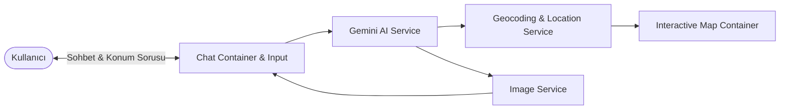

# 🗺️ Gemini MCP Maps - AI-Powered Geospatial Assistant & Map Tools

[](https://www.typescriptlang.org/)
[](https://vitejs.dev/)
[](https://modelcontextprotocol.io/)
[](https://deepmind.google/technologies/gemini/)
[](https://www.yucelgumus.dev/)

> **Google Gemini AI** ve **Model Context Protocol (MCP)** standartlarını kullanarak doğal dil konum sorgularını coğrafi koordinatlara, harita işaretçilerine ve anlık mekan görsellerine dönüştüren harita ve rota asistanı.

---

## 🌟 Öne Çıkan Özellikler

- 💬 **Doğal Dil ile Harita Kontrolü:** Kullanıcının sohbet penceresinde sorduğu yerleri veya rotaları analiz ederek haritada otomatik odaklanma (pan/zoom) ve marker yerleştirme.
- 📍 **Geocoding & Ters Geocoding Entegrasyonu:** Adresleri anında koordinatlara ve koordinatları anlamsal mekan bilgilerine dönüştürme (`geocoding.service.ts`).
- 🖼️ **Mekan Görselleri & Zenginleştirme:** Sorgulanan konumların yüksek kaliteli fotoğraflarını çekip sohbet akışında ve harita üzerinde gösterme.
- ⚡ **Hafif ve Tip Güvenli Mimari:** TypeScript ve saf modern DOM optimizasyonları ile yüksek render performansı.

---

## 🏗️ Mimari & Çalışma Şeması



---

## 🚀 Hızlı Başlangıç

### Gereksinimler
- **Node.js**: v18.0+
- **Google Gemini API Key**

### Kurulum

```bash
git clone https://github.com/yucel-gumus/gemini-mcp-maps.git
cd gemini-mcp-maps

npm install
```

### Ortam Değişkenleri (`.env`)

```env
VITE_GEMINI_API_KEY=your_gemini_api_key_here
```

### Çalıştırma

```bash
npm run dev
```

---

## 📂 Proje Dizin Yapısı

```
gemini-mcp-maps/
├── index.html
├── package.json
├── vite.config.ts
└── src/
    ├── main.ts
    ├── types/                      # Tip tanımları
    ├── constants/                  # Promptlar ve sistem yapılandırması
    ├── utils/                      # Konum ve metin ayrıştırma yardımcıları
    ├── services/
    │   ├── ai.service.ts           # Gemini API istemcisi
    │   ├── geocoding.service.ts    # Koordinat çözümleme
    │   └── image.service.ts        # Mekan görsel servisi
    └── components/
        ├── Chat/                   # Sohbet arayüzü
        ├── Map/                    # Harita motoru
        └── shared/                 # Markdown ayrıştırıcı
```

---

## 📄 Lisans
Bu proje [MIT Lisansı](LICENSE) ile lisanslanmıştır.

---

## 👨‍💻 Geliştirici & İletişim

**Yücel Gümüş** - Full Stack Developer

- 🌐 **Web Sitesi / Portfolyo:** [yucelgumus.dev](https://www.yucelgumus.dev/)
- 💼 **LinkedIn:** [linkedin.com/in/yucel-gumus](https://www.linkedin.com/in/yucel-gumus/)
- 🐙 **GitHub:** [@yucel-gumus](https://github.com/yucel-gumus)

<p align="left">
  <a href="https://www.yucelgumus.dev/" target="_blank" rel="noopener noreferrer">
    
  </a>
</p>